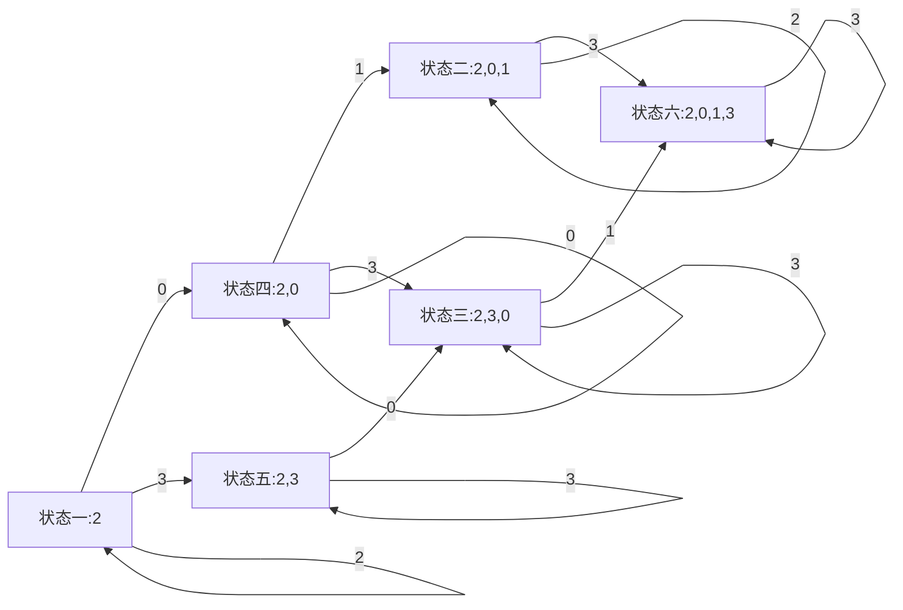

## CCS-CSP 2013-12 批次 题目4 

### 问题描述

　　我们把一个数称为有趣的，当且仅当：

  　　1. 它的数字只包含0, 1, 2, 3，且这四个数字都出现过至少一次。
  　　2. 所有的0都出现在所有的1之前，而所有的2都出现在所有的3之前。
  　　3. 最高位数字不为0。
       因此，符合我们定义的最小的有趣的数是2013。除此以外，4位的有趣的数还有两个：2031和2301。
       　　请计算恰好有n位的有趣的数的个数。由于答案可能非常大，只需要输出答案除以1000000007的余数。

### 输入格式

　　输入只有一行，包括恰好一个正整数n (4 ≤ n ≤ 1000)。

### 输出格式

　　输出只有一行，包括恰好n 位的整数中有趣的数的个数除以1000000007的余数。

### 样例输入

4

### 样例输出

3

### 解题思路

#### 1. 方向

首先分析答案的形式，“有趣的数”是这样的：

- 包含0、1、2、3
- 0在1之前、2在3之前
- 最高位不为0

- 那么既然最高位不为0，那么肯定不为1，但是2又要在3前面，那么最高位肯定是2；

暂时能得到的条件有这些，下面正式分析正确答案的形式：

n位有趣的数N可以通过前n-1位数字和第n位数字组合进行推导，如果它是有趣的数，那么第n位数字和前n-1位组成的数字有如下关系：

1. 前n-1位有2、0、1，那么当前位置选择3就构成了有趣的数
2. 前n-1位有2、0、1、3，那么当前位置选择3或者1就可以构成有趣的数
3. 前n-1为有2、3、0，那么当前位置选择1则构成有趣的数

除了上述3中情况其余情况都不能使N变成有趣的数；那么这三种状态的前置状态又是什么呢？

##### 对于状态1

4. 当前n-2位数字全是2、0，第n-2位数字为1时构成状态1

##### 对于状态2

5. 当前n-2位数字全是2、0、1，第n-2位数字为3时构成状态2
6. 当前n-2位数字全是2、3、0，第n-2位数字为1时构成状态2

##### 对于状态3

7. 当前n-2为数字全是2、3，第n-2位数字为0时构成状态3
8. 当前n-2位数字全是2、0，第n-2位数字为3时构成状态3

对于以上分析，状态5等同于状态1，状态6等同于状态3，状态8等同于状态4，那么对于状态4、状态7来说右是如何构成的呢？

##### 对于状态4

9. 前n-3位数字都是2，第n-3位数字为0时构成状态4
10. 前n-3位数字全是2、0，第n-3位数字为2或0时构成状态4

##### 对于状态7

11. 前n-3位数字全是2，第n-3位数字为3时构成状态7
12. 前n-3位数字全是2、3，第n-3位数字为3时构成状态7

对于标号9-12来说，状态9等价于状态11，状态10等价于状态8，状态12等价于状态7，那么整理如下(**突出部分为单独的状态**)：

> 1. **前n-1位有2、0、1，那么当前位置选择3就构成了有趣的数**
> 2. **前n-1位有2、0、1、3，那么当前位置选择3或者1就可以构成有趣的数**
> 3. **前n-1为有2、3、0，那么当前位置选择1则构成有趣的数**
> 4. **当前n-2位数字全是2、0，第n-2位数字为1时构成状态1**
> 5. 当前n-2位数字全是2、0、1，第n-2位数字为3时构成状态2
> 6. 当前n-2位数字全是2、3、0，第n-2位数字为1时构成状态2
> 7. **当前n-2为数字全是2、3，第n-2位数字为0时构成状态3**
> 8. 当前n-2位数字全是2、0，第n-2位数字为3时构成状态3
> 9. **前n-3位数字都是2，第n-3位数字为0时构成状态4**
> 10. 前n-3位数字全是2、0，第n-3位数字为2或0时构成状态4
> 11. 前n-3位数字全是2，第n-3位数字为3时构成状态7
> 12. 前n-3位数字全是2、3，第n-3位数字为3时构成状态7

对上述状态进行整理归纳有：

> 1. 前面n-1位数字都是2
> 2. 前面n-1位数字都是2、0、1
> 3. 前面n-1位数字都是2、3、0
> 4. 前面n-1位数字都是2、0
> 5. 前面n-1位数字都是2、3
> 6. 前面n-1位数字都是2、0、1、3

其中各种状态的状态转换可以通过状态转化图表示，状态转换图为：



所以针对上述分析，我们如果想获得一个N位的“有趣的数”，那么其必然是处于状态六的，而状态六需要根据前n-1个数字的状态做推导，比如通过状态二和状态三获得；而对于状态三来说，它又要通过状态四和状态五和状态三推得，这样以此类推就可以产生如下公式：（设```state[i][j]```表示第i为数字处于状态```j```的个数

1. ```state[i][1]``` = 1（只能通过自身状态转化）
2. ```state[i][2]``` = 2 * ```state[i-1][2]``` + ```state[i-1][4]```（自身有两种状态可以转化过来，从状态四也可以转化过来）
3. ```state[i][3]``` = 2 * ```state[i-1][3]``` + ```state[i-1][5]``` + ```state[i-1][4]```（自身有两种状态可以自转，状态四、五也可以转化过来）
4. ```state[i][4]``` = ```state[i-1][1]``` + 2 * ```state[i-1][4]```（自身有两种转换方式自转，从状态1也可转换过来）
5. ```state[i][5]``` = ```state[i-1][5]``` + ```state[i][1]```（自身有一种转换方式自转，从状态一也可以转换过来）
6. ```state[i][6]``` = 2 * ```state[i-1][6]``` + ```state[i-1][2]``` +```state[i-1][3]```（自身有两种方式自转，从状态三、二也可以转换过来）

所以对上述六种状态转换公式，对输入位数N做迭代处理即可。

#### 2. 步骤

1. 初始化状态数组
2. 公式迭代
3. 输出结果

#### 3. Github地址

https://github.com/duanqiangk/CCS-CSP-Exam.git